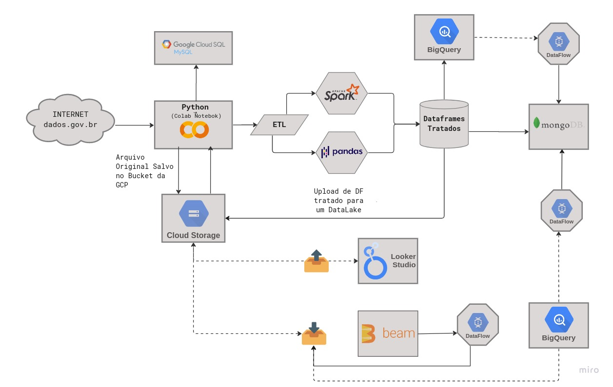
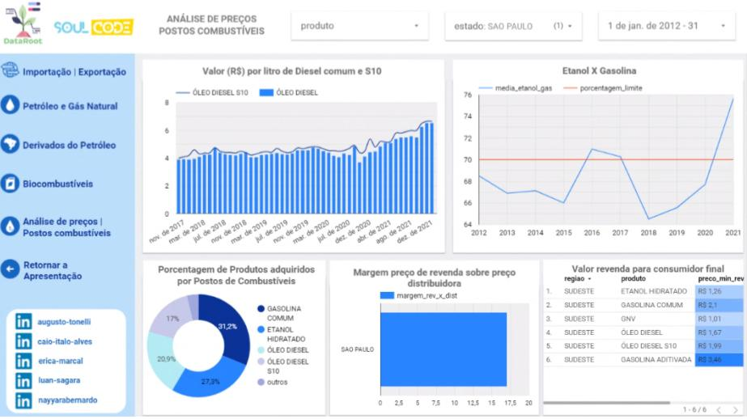

# Projeto final do curso Engenharia de Dados da SoulCode 

Esse é o Projeto Final de Conclusão do Bootcamp de Engenharia de Dados promovido pela SoulCode Academy. O tema dado à equipe foi o de Combustíveis e os Datasets obtidos foram extraídos desse link.

## Workflow

### Tecnologias utilizadas para realização do projeto:
- Google Cloud Platform (GCP)
- Cloud Storage
- Looker Studio
- BigQuery
- DataFlow
- Python
- Pandas
- PySpark
- SparkSQL
- Apache Beam
- MongoDB

## Dashboard

Para visualização completa do [Dashboard](https://lookerstudio.google.com/reporting/a48904e7-3eb9-42db-8ad9-c107c1cd9fc0)

## Objetivo

O objetivo deste projeto é obter insights sobre o mercado de combustíveis no Brasil, analisando os valores das operações comerciais de importação e exportação, os valores de importação do etanol no período da safra, a receita gerada por tipos de produtos de importação e exportação, a produção por tempo, a produção de combustíveis no Brasil, o volume de produção por estado e o volume de produção por refinaria, além da produção, uso interno e venda externa. 
Foram realizadas análise de dados públicos do Brasil sobre petróleo e derivados, biocombustíveis e gás natural no período de 2012 a 2021, em relação a variáveis de impacto: 

- nos preços de revenda e margem de ganho; 
- no volume de produção; 
- nas importações e exportações. 

